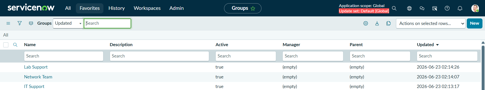
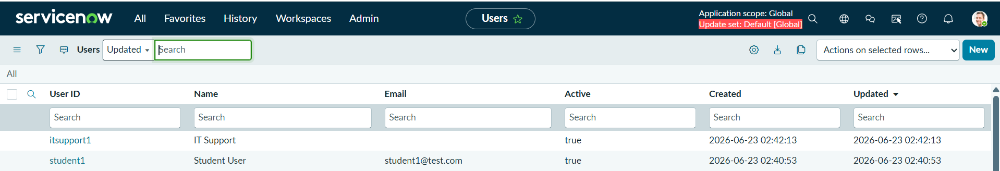
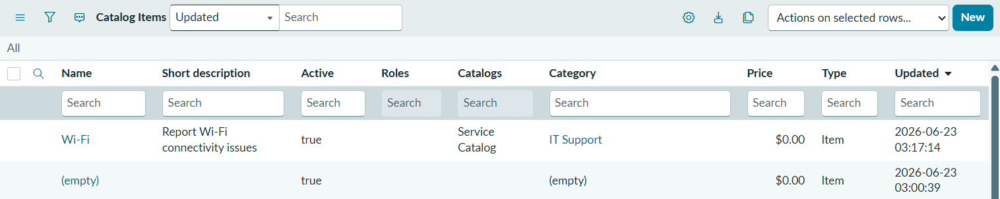
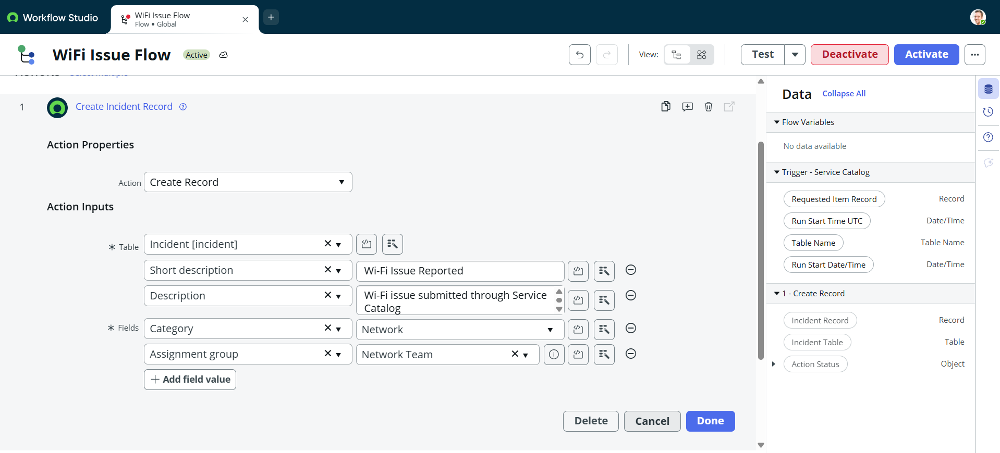
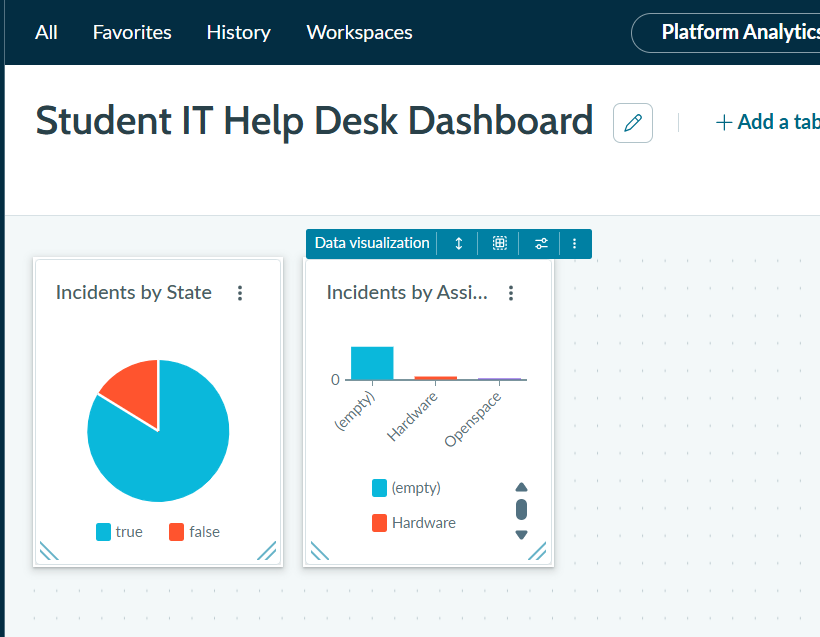
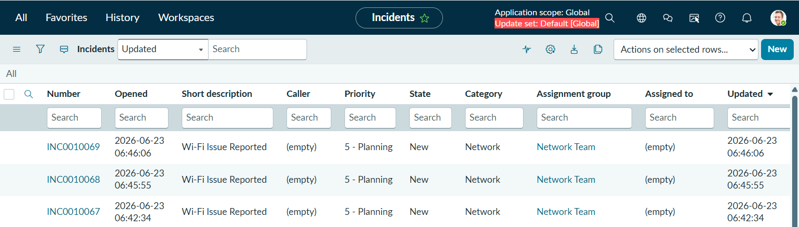

# CSA Student IT Helpdesk

A ServiceNow CSA project for managing student IT support requests.

## Features
## Screenshots

### Groups

### Users

### Catalog Item

### Flow Designer

### Dashboard

### Incident Created

Created by: Niharika Bantupalli
