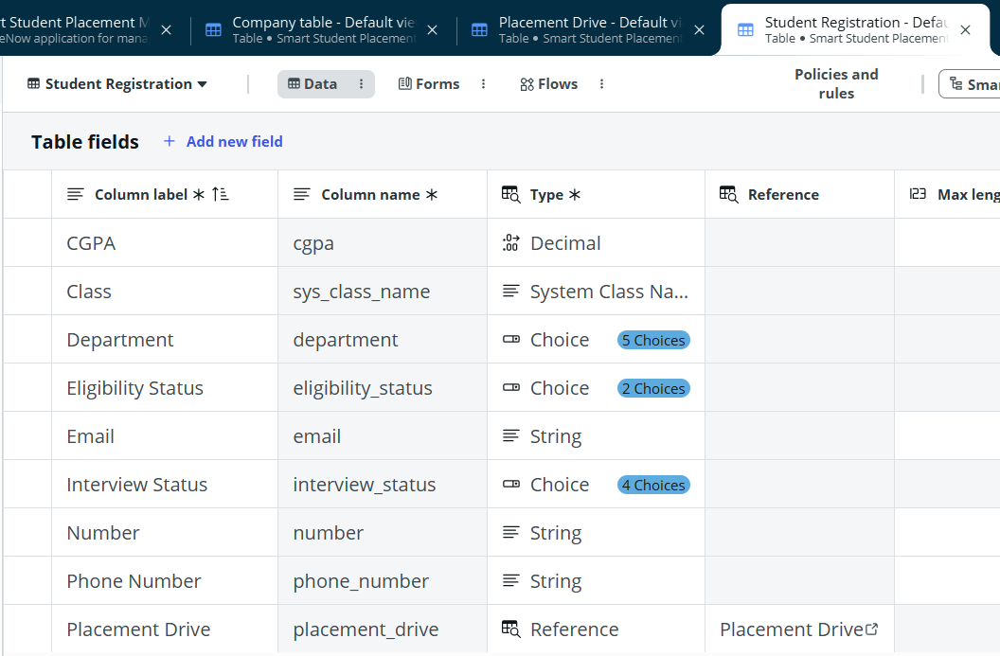
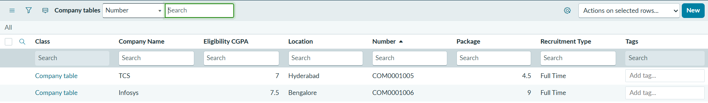
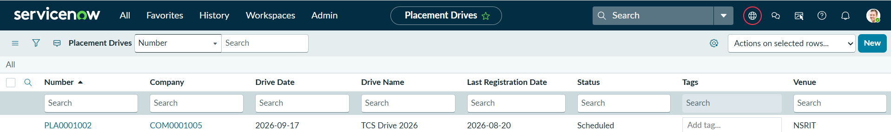
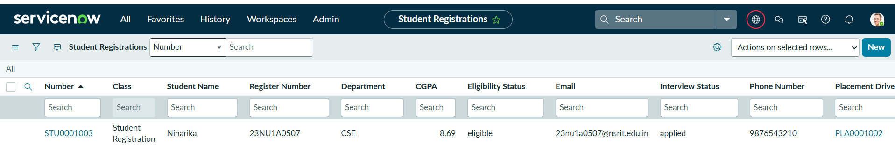

# Smart Student Placement Management

## Project Overview
Smart Student Placement Management is a ServiceNow application designed to streamline campus placement activities.

## Features
- Student Registration
- Company Management
- Placement Drive Management
- Eligibility Tracking
- Interview Status Tracking
- Placement Reports

## Technologies Used
- ServiceNow App Engine Studio
- Tables and Forms
- Flow Designer
- Business Rules

## Screenshots

### Application Created

### Company Table

### Drive Table

### Student Registration Table

### Modules

### Company Data

### Drive Data

### Student Data

